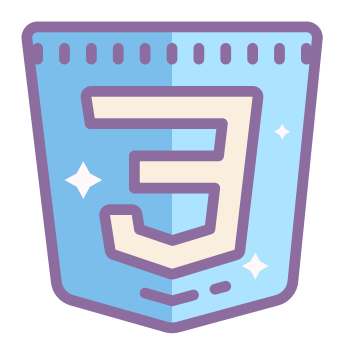
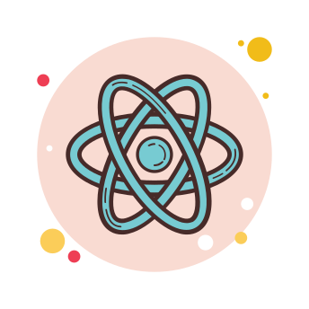
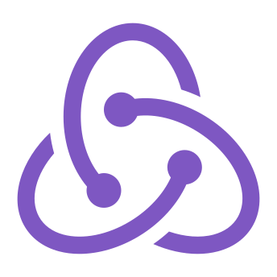
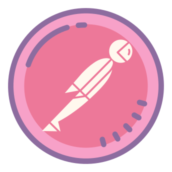

### Here is What I'm Working On!👋

- 🔭 I’m currently working on ... React
- 🌱 I’m currently learning ... React,Redux
- 💬 Ask me about Anything
- 😄 Pronouns: He/Him

---

### Programming Languages  🚀
 |
 | |  | | |   

---

### Tools 🔥
| | | 

---

---

### How to reach me 😏

